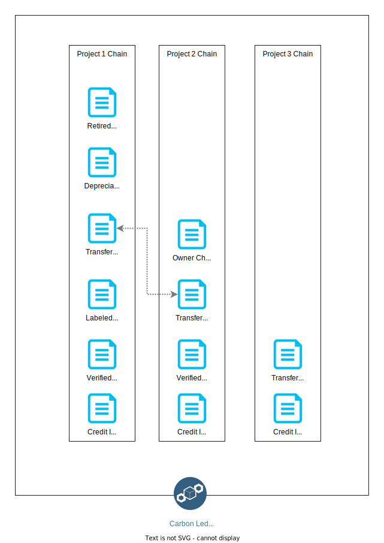

# National Carbon Credit Registry

<a name="about"></a>


 
[](https://www.sparkblue.org/group/keeping-track-digital-public-goods-paris-agreement)
[](https://app.digitalpublicgoods.net/a/10403)

The National Carbon Registry enables carbon credit trading in order to reduce greenhouse gas emissions.

As an online database, the National Carbon Registry uses national and international standards for quantifying and verifying greenhouse gas emissions reductions by projects, tracking issued carbon credits and enabling credit transfers in an efficient and transparent manner. The Registry functions by receiving, processing, recording and storing data on mitigations projects, the issuance, holding, transfer, acquisition, cancellation, and retirement of emission reduction credits. This information is publicly accessible to increase public confidence in the emissions reduction agenda.

The National Carbon Registry enables carbon credit tracking transactions from mitigation activities, as the digital implementation of the Paris Agreement. Any country can customize and deploy a local version of the registry then connect it to other national & international registries, MRV systems, and more.

The system has 3 key features:

* **Analytics Dashboard:** Enabling governments, companies, and certification bodies to operate transparently and function on an immutable blockchain.
* **Carbon Credit Calculator:** Standardized system According to the UNFCCC - CDM (Clean Development Mechanism) methodologies, across defined sectors.
* **Serial Number Generator:** Standardizing the technical format to allow for easy cross-border collaboration between carbon trading systems.

## Index

* [About](#about)
* [Standards](#standards)
* [System Architecture](#architecture)
* [Project Structure](#structure)
* [Run Services as Containers](#container)
* [Run Services Locally](#local)
* [Deploy System on the AWS Cloud](#cloud)
* [Modules](#modules)
* [Web Frontend](#frontend)
* [Localization](#localization)
* [API (Application Programming Interface)](#api)
* [Status Page](#status)
* [User Manual](#manual)
* [Demonstration Video](#demo)
* [Data Sovereignty](#data)
* [Governance and Support](#support)

<a name="standards"></a>

## Standards

This codebase aims to fulfill the [Digital Public Goods standard](https://digitalpublicgoods.net/standard/), adheres to the [UNDP Data Principles](https://data.undp.org/data-principles), and it is built according to the [Principles for Digital Development](https://digitalprinciples.org/).

<a name="architecture"></a>

## System Architecture

UNDP Carbon Registry is based on service oriented architecture (SOA). Following diagram visualize the basic components in the system.


<a name="services"></a>

### System Services

### National Service

Authenticate, Validate and Accept user (Government, Project Developer/Certifier) API requests related to the following functionalities,

* User and company CRUD operations.
* User authentication.
* Project life cycle management.
* Credit life cycle management.

Service is horizontally scalable and state maintained in the following locations,

* File storage.
* Operational Database.
* Ledger Database.

Uses the Carbon Credit Calculator and Serial Number Generator node modules to estimate the project carbon credit amount and issue a serial number.
Uses Ledger interface to persist project and credit life cycles.

### Analytics Service

Serve all the system analytics. Generate all the statistics using the operational database.
Horizontally scalable.

### Replicator Service

Asynchronously replicate ledger database events in to the operational database. During the replication process it injects additional information to the data for query purposes (Eg: Location information).
Currently implemented for QLDB and PostgreSQL ledgers. By implementing [replicator interface](./backend/services/src/ledger-replicator/replicator-interface.service.ts) can support more ledger replicators.
Replicator select based on the `LEDGER_TYPE` environment variable. Support types are `PGSQL` (default) and `QLDB`.

### Deployment

System services can deploy in 2 ways.

* **As a Container** - Each service boundary containerized in to a docker container and can deploy on any container orchestration service. [Please refer Docker Compose file](./docker-compose.yml)
* **As a Function** - Each service boundary packaged as a function (Serverless) and host on any Function As A Service (FaaS) stack. [Please refer Serverless configuration file](./backend/services/serverless.yml)

### **External Service Providers**

All the external services access through a generic interface. It will decouple the system implementation from the external services and enable extendability to multiple services.

#### Geo Location Service

Currently implemented for 2 options.

1. File based approach. User has to manually add the regions with the geo coordinates. [Sample File](./backend/services/regions.csv). To apply new file changes, replicator service needs to restart.
2. [Mapbox](https://mapbox.com). Dynamically query geo coordinates from the Mapbox API.

Can add more options by implementing [location interface](./backend/services/src/shared/location/location.interface.ts)

Change by environment variable `LOCATION_SERVICE`. Supported types are `FILE` (default) and `MAPBOX`.

#### File Service

Implemented 2 options for static file hosting.

1. NestJS static file hosting using the local storage and container volumes.
2. AWS S3 file storage.

Can add more options by implementing [file handler interface](./backend/services/src/shared/file-handler/filehandler.interface.ts)

Change by environment variable `FILE_SERVICE`. Supported types are `LOCAL` (default) and `S3`.

### **Database Architecture**

Primary/secondary database architecture used to store carbon project and account balances.
Ledger database is the primary database. Add/update projects and update account balances in a single transaction. Currently implemented only for AWS QLDB

Operational Database is the secondary database. Eventually replicated to this from primary database via data stream. Implemented based on PostgreSQL

#### Why Two Database Approach?

1. Cost and Query capabilities - Ledger database (blockchain) read capabilities can be limited and costly. To support rich statistics and minimize the cost, data is replicated in to a cheap query database.
2. Disaster recovery
3. Scalability - Primary/secondary database architecture is scalable since additional secondary databases can be added as needed to handle more read operations.

#### Why Ledger Database?

1. Immutable and Transparent - Track and maintain a sequenced history of every carbon project and credit change.
2. Data Integrity (Cryptographic verification by third party).
3. Reconcile carbon credits and company account balance.

#### Ledger Database Interface

This enables the capability to add any blockchain or ledger database support to the carbon registry without functionality module changes. Currently implemented for PostgreSQL and AWS QLDB.

#### PostgreSQL Ledger Implementation

This ledger implementation stores all the carbon project and credit events in a separate event database with the sequence number. Support all the ledger functionalities except immutability.  

Single database approach used for user and company management.

### **Ledger Layout**

Carbon Registry contains 3 ledger tables.

1. Project ledger - Contains all the project and credit transactions.
2. Company Account Ledger (Credit) - Contains company accounts credit transactions.
3. Country Account Ledger (Credit) - Contains country credit transactions.

The below diagram demonstrates the ledger behavior of project create, authorise, issue and transfer processes. Blue color document icon denotes a single data block in a ledger.



### **Authentication**

* JWT Authentication - All endpoints based on role permissions.
* API Key Authentication - MRV System connectivity.

<a name="structure"></a>

## Project Structure

```text
.
├── .github                         # CI/CD [Github Actions files]
├── deployment                      # Declarative configuration files for initial resource creation and setup [AWS Cloudformation]
├── backend                         # System service implementation
    ├── services                    # Services implementation [NestJS application]
        ├── src
            ├── national-api        # National API [NestJS module]      
            ├── stats-api           # Statistics API [NestJS module]
            ├── ledger-replicator   # Blockchain Database data replicator [QLDB to Postgres]
            ├── shared              # Shared resources [NestJS module]     
        ├── serverless.yml          # Service deployment scripts [Serverless + AWS Lambda]
├── libs
    ├── carbon-credit-calculator    # Implementation for the Carbon credit calculation library [Node module + Typescript]
    ├── serial-number-gen           # Implementation for the carbon project serial number calculation [Node module + Typescript]
├── web                             # System web frontend implementation [ReactJS]
├── .gitignore
├── docker-compose.yml              # Docker container definitions
└── README.md
```

<a name="container"></a>

## Run Services As Containers

* Update [docker compose file](./docker-compose.yml) env variables as required.
  * Currently all the emails are disabled using env variable `IS_EMAIL_DISABLED`. When the emails are disabled email payload will be printed on the console. User account passwords needs to extract from this console log. Including root user account, search for a log line starting with `Password (temporary)` on national container (`docker logs -f undp-carbon-registry-national-1`).
  * Add / update following environment variables to enable email functionality.
    * `IS_EMAIL_DISABLED`=false
    * `SOURCE_EMAIL` (Sender email address)
    * `SMTP_ENDPOINT`
    * `SMTP_USERNAME`
    * `SMTP_PASSWORD`
  * Use `DB_PASSWORD` env variable to change PostgreSQL database password
  * Configure system root account email by updating environment variable `ROOT EMAIL`. If the email service is enabled, on the first docker start, this email address will receive a new email with the root user password.
  * By default frontend does not show map images on dashboard and project view. To enable them please update `REACT_APP_MAP_TYPE` env variable to `Mapbox` and add new env variable `REACT_APP_MAPBOXGL_ACCESS_TOKEN` with [MapBox public access token](https://docs.mapbox.com/help/tutorials/get-started-tokens-api/) in web container.
* Add user data
  * Update [organisations.csv](./organisations.csv) file to add organisations.
  * Update [users.csv](./users.csv) file to add users.
  * When updating files keep the header and replace existing dummy data with your data.
  * These users and companies add to the system each docker restart.
* Run `docker-compose up -d --build`. This will build and start containers for following services:
  * PostgresDB container
  * National service
  * Analytics service
  * Replicator service
  * React web server with Nginx.
* Web frontend on <http://localhost:3030/>
* API Endpoints,
  * <http://localhost:3000/national/>
  * <http://localhost:3100/stats/>

<a name="local"></a>

## Run Services Locally

* Setup postgreSQL locally and create a new database.
* Update following DB configurations in the `.env.local` file (If the file does not exist please create a new `.env.local`)
  * `DB_HOST` (default `localhost`)
  * `DB_PORT` (default `5432`)
  * `DB_USER` (default `root`)
  * `DB_PASSWORD`
  * `DB_NAME` (default `carbondbdev`)
* Move to folder `cd backend/service`
* Run `yarn run sls:install`
* Initial user data setup

```sh
serverless invoke local --stage=local --function setup --data '{"rootEmail": "<Root user email>","systemCountryCode": "<System country Alpha 2 code>", "name": "<System country name>", "logoBase64": "<System country logo base64>"}'
```

* Start all the services by executing
  
```sh
sls offline --stage=local
```

* Now all the system services are up and running. Swagger documentation will be available on <http://localhost:3000/local/national>

<a name="cloud"></a>

## Deploy System on the AWS Cloud

* Execute to create all the required resources on the AWS.

```sh
aws cloudformation deploy --template-file ./deployment/aws-formation.yml --stack-name carbon-registry-basic --parameter-overrides EnvironmentName=<stage> DBPassword=<password> --capabilities CAPABILITY_NAMED_IAM
```

* Setup following Github Secrets to enable CI/CD
  * `AWS_ACCESS_KEY_ID`
  * `AWS_SECRET_ACCESS_KEY`
* Run it manually to deploy all the lambda services immediately. It will create 2 lambda layers and following lambda functions,
  * national-api: Handle all carbon registry user and program creation. Trigger by external http request.
  * replicator: Replicate Ledger database entries in to Postgres database for analytics. Trigger by new record on the Kinesis stream.
  * setup: Function to add initial system user data.
* Create initial user data in the system by invoking setup lambda function by executing

```sh
aws lambda invoke \
    --function-name carbon-registry-services-dev-setup --cli-binary-format raw-in-base64-out\
    --payload '{"rootEmail": "<Root user email>","systemCountryCode": "<System country Alpha 2 code>", "name": "<System country name>", "logoBase64": "<System country logo base64>"}' \
    response.json
```

<a name="modules"></a>

## Modules

### Serial Number Generation

Serial Number generation is implemented in a separate node module. [Please refer to this](./libs/serial-number-gen/README.md) for more information.

### Carbon Credit Calculator

Carbon credit calculation is implemented in a separate node module. [Please refer to this](./libs/carbon-credit-calculator/README.md) for more information.

### UNDP Platform for Voluntary Bilateral Cooperation

UNDP Platform for Voluntary Bilateral Cooperation generation is implemented in a separate node module. [Please refer this](./modules/Platform%20for%20Voluntary%20Bilateral%20Cooperation/README.md) for more information.

<a name="frontend"></a>

### Web Frontend

Web frontend implemented using ReactJS framework. Please refer [getting started with react app](./web/README.md) for more information.

<a name="localization"></a>

### Localization

* Languages (Current): English
* Languages (In progress): French, Spanish

Please refer [here](./web/public/locales/i18n/README.md) for adding a new language translation file.

<a name="api"></a>

### API (Application Programming Interface)

For integration, reference RESTful Web API Documentation documentation via Swagger. To access

* National API: `api.APP_URL`/national
* Status API: `api.APP_URL`/stats

Our [Data Dictionary](./Data%20Dictionary.csv) is available for field analysis.

<a name="resource"></a>

### Resource Requirements

| Resource | Minimum | Recommended |
| :---         |           ---: |          ---: |
| Memory   | 4 GB    | 8 GB    |
| CPU     | 4 Cores       |   4 Cores   |
| Storage     |  20 GB       |   50 GB   |
| OS     | Linux <br/> Windows Server 2016 and later versions.      |      |

Note: Above resource requirement mentioned for a single instance from each microservice.status.APP_URL

<a name="status"></a>

### Status Page

For transparent uptime monitoring go to the [status page](https://status.carbreg.org/).

Open source code available at <https://github.com/undp/carbon-registry-status>

<a name="manual"></a>

### User Manual

To learn more about how the system is structured and how to manage it visit the [user manual](https://github.com/undp/carbon-registry/blob/main/documention/manual.md)

<a name="demo"></a>

### Demonstration Video

Watch our [demo walkthrough](https://www.youtube.com/watch?v=xSxXvcPveT0)
[](https://www.youtube.com/watch?v=xSxXvcPveT0)

<a name="data"></a>

### Data Sovereignty

The code is designed with data sovereignty at its core, empowering nations and organizations to have greater control and governance over their environmental data. Here are the key points highlighting how this system promotes data sovereignty:

- **Local Control**: 
   - Allows nations and entities to store, manage, and process their data locally or in a preferred jurisdiction, adhering to local laws and regulations.
- **Open Source Architecture**:
   - Facilitates transparency, customization, and control over the software, enabling adaptation to specific legal and regulatory requirements.
- **Decentralized Infrastructure**:
   - Supports a decentralized data management approach, minimizing reliance on external or centralized systems.
- **Standardized yet Flexible Protocols**:
   - Provides standardized protocols for data management while allowing for local customization, aligning with the diverse legal landscapes.
- **Secure Data Sharing and Access Control**:
   - Implements robust access control and secure data sharing mechanisms, ensuring only authorized entities can access or alter the data.
- **Audit Trails**:
   - Offers comprehensive audit trails for all data transactions, ensuring traceability and accountability in data handling and reporting.
- **Enhanced Privacy Compliance**:
   - Helps in ensuring compliance with privacy laws and regulations by providing tools for secure data handling and consent management.

By integrating these features, the code significantly contributes to achieving data sovereignty, promoting a more localized and accountable management of environmental data in line with the goals of the Paris Agreement.

<a name="support"></a>

### Governance and Support

[Digital For Climate (D4C)](https://www.theclimatewarehouse.org/work/digital-4-climate) is responsible for managing the application. D4C is a collaboration between the [European Bank for Reconstruction and Development (EBRD)](https://www.ebrd.com), [United Nations Development Program (UNDP)](https://www.undp.org), [United Nations Framework Convention on Climate Change (UNFCCC)](https://www.unfccc.int), [International Emissions Trading Association (IETA)](https://www.ieta.org), [European Space Agency (ESA)](https://www.esa.int), and [World Bank Group](https://www.worldbank.org) that aims to coordinate respective workflows and create a modular and interoperable end-to-end digital ecosystem for the carbon market. The overarching goal is to support a transparent, high integrity global carbon market that can channel capital for impactful climate action and low-carbon development.

This code is managed by [United Nations Development Programme](https://www.undp.org) as custodian, detailed in the [press release](https://www.undp.org/news/newly-accredited-digital-public-good-national-carbon-registry-will-help-countries-meet-their-climate-targets). For any questions, contact us at [digital4planet@undp.org](mailto:digital4planet@undp.org).
