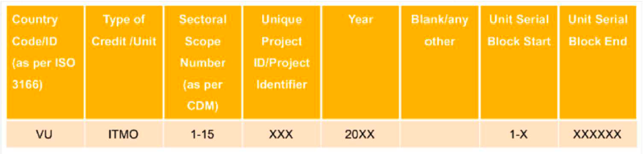

# Carbon Registry - Serial Number Generation

## Table of Contents

Document Information
1. Introduction 
2. Serial Number Generator
    - 2.1. Serial Number Standard
    - 2.2. Country Code
    - 2.3. Type of Credit/ Unit
    - 2.4. Sectoral Scope Number (as per CDM)
    - 2.5. Unique Project ID
    - 2.6. Unit Serial Block – Start
    - 2.7. Unit Serial Block – End
3. Usage

# 1. Introduction
Once carbon programme that was added to the system is Authorized, a unique serial number should be generated for every programme by the Carbon Registry.

# 2. Serial Number Generator

## 2.1 Serial Number Standard



Serial Number character length:

| Block Name | Type | Possible Values |
| --- | --- | --- |
| Country Code (as per ISO 3166) | String | ISO 3166-1 alpha-2 value |
| Type of Credit/Unit | String | ITMO |
| Sectoral Scope Number (as per CDM) | Integer | 1-15
| Unique Programme ID | Integer | XXX |
| Year | Integer | 20XX |
| Blank/ any other | String | 0 |
| Unit Serial Block - Start | Integer | 1 - X |
| Unit Serial Block - End | Integer | XXXXXX |

The blocks will be separated by the delimiter dash (-)<br>
Eg:
VU-ITMO-11-356-2022-0-27-35


## 2.2 Country Code

Standard needs to be followed `ISO 3166-1 alpha-2` two-letter country codes. 

Eg.
| Country Name | ISO 3166-1 alpha-2 code |
| --- | --- |
| Costa Rica | CR |
| Fiji | FJ |

## 2.3 Type of Credit/ Unit
Carbon credit measurement unit: ITMO

## 2.4 Sectoral Scope Number
According to the UNFCCC - CDM (Clean Development Mechanism methodologies, identified Sectors and Sectoral scope numbers are as follows:


| Scope Number | Sectoral Scope |
| --- | --- |
| 1 | Energy industries (renewable - / non-renewable sources) |
| 2 | Energy distribution |
| 3 | Energy demand |
| 4 | Manufacturing industries |
| 5 | Chemical industries |
| 6 | Construction |
| 7 | Transport |
| 8 | Mining/mineral production |
| 9 | Metal production |
| 10 | Fugitive emissions from fuels (solid, oil and gas) |
| 11 | Fugitive emissions from production and consumption of halocarbons and sulphur hexafluoride |
| 12 | Solvent use |
| 13 | Waste handling and disposal |
| 14 | Afforestation and reforestation |
| 15 | Agriculture |

## 2.5 Unique Programme ID
format: XXX, When it exceeds the limit of possibilities it will go beyond 3 digits. 

Contains only numbers

## 2.6 Unit Serial Block – Start
Serial Block Start – Total number of credits before issuing the credits for the programme + 1 <br>
The start of the serial block will be represented without the decimal point of the credit value. It will be represented as a rounded integer.

## 2.7 Unit Serial Block – End
Serial Block End – Total number of credits after issuing the credits for the programme. <br>
The end of the serial block will be represented without the decimal point of the credit value.
It will be represented as a rounded integer.

Eg:

| Programme Current | Block End | Credit Value | Credit Value (Rounded) | Serial Block Start | Serial Block End |
| --- | --- | --- | --- | --- | --- |
| Programme 1 | | 25.51 | 26 | 1 | 26 |
| Programme 2 | 26 | 10.000 | 10 | 27 | 36 |
| Programme 3 | 36 | 5.4341 | 5 | 37 | 41 |
| Programme 4 | 41 | 0.1285 | 0 | Programme Rejected as credit value is 0. |
| Programme 5 | 41 | 14.7 | 15 | 42 | 56 |


# 3. Usage
```
import { generateSerialNumber } from 'serial-number-gen';

const serialNo = generateSerialNumber(countryCodeA2, sectoralScope, programmeId, year, startBlock, endBlock, creditUnit);

```

### Parameters
| Block Name | Description |
| --- | --- |
| countryCodeA2 | Country Code (as per ISO 3166) |
| sectoralScope | Sectoral Scope Number ([as per CDM](###sectoral-scope-number)) (1-15)
| programmeId | Unique Programme ID |
| Year | Year in format XXXX |
| startBlock | Current ledger credit value (inclusive)|
| endBlock | Credit value with the current program  (inclusive)|
| creditUnit | Carbon credit unit (Eg: ITMO)