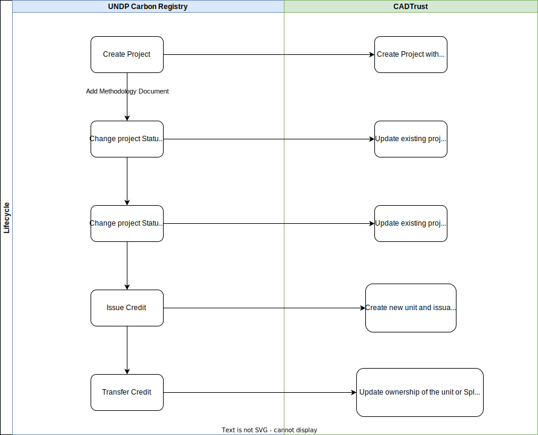
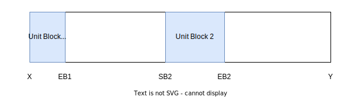
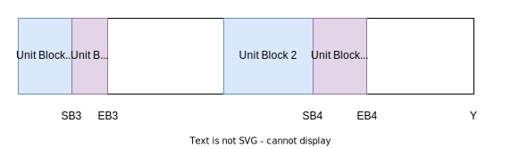
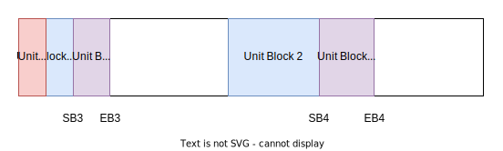
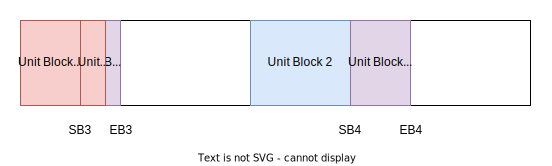

# Module: Climate Action Data Trust Integration
Integration of the UNDP National Carbon Registry with the Climate Action Data Trust (CADTrust)

## <b>Instructions</b>
- Synchronization of data was completed using the CADTrust REST API, as outlined in the documentation available at https://github.com/Chia-Network/cadt/blob/main/docs/cadt_rpc_api.md.
- Currently integration done only for
    - Project creation
    - Project status update
    - Project credit issuance
    - Project credit transfer
- If you are creating your own Chia node, please refer to the following documentation. Ensure that the Chia node data layer is running.
    - https://github.com/Chia-Network/chia-blockchain/wiki/INSTALL
    - https://github.com/Chia-Network/chia-blockchain/wiki/How-to-Connect-to-the-Testnet
- To create your own CADTrust Server refer following installation guide
    - https://github.com/Chia-Network/cadt#installation
- After completing the setup, you can choose to either create a new organization for your registry, a process that typically takes about 15 to 20 minutes, or subscribe to an existing organization.

## <b>Data Synchronization</b>

## <b>Project Creation</b>
- CADTrust endpoint https://github.com/Chia-Network/cadt/blob/main/docs/cadt_rpc_api.md#stage-a-new-project-with-the-minimum-required-fields
- The Carbon Registry will create a program immediately but in an asynchronous manner. Once the project is created on CADTrust, it will commit changes instantly. However, it takes approximately 5 minutes for the new project to be fully propagated on the blockchain.
- The UUID generated in the CADTrust response is saved in the `cadtId` field of the Registry project for future reference. 
- UNDP to CADTrust project field mapping

    | **Name in the CADTrust Platform**   | **Name in the Carbon Registry**   |
    | --- | --- |
    | projectId | programmeId |
    | originProjectId | programmeId  |
    | currentRegistry | < Config: systemCountryName > |
    | registryOfOrigin  | < Config: systemCountryName > `Standard Carbon Registry` |
    | projectName  |  title |
    | projectLink  | < Registry programme view URL, Eg: https://test.carbreg.org/programmeManagement/view/25583 >  |
    | projectDeveloper  |  < Comma separated company names >  |
    | sector | sector  |
    | projectType | `Pending` |
    | coveredByNDC | `Inside NDC` |
    | projectStatus | currentStage < Refer project [status mapping](#status-update) > |
    | projectStatusDate | startTime < Formatted to yyyy-MM-dd > |
    | unitMetric | `tCO2e` |
    | methodology | `Pending` |
    | <b>estimations</b> |  |
    | unitCount | creditEst |
    | creditingPeriodStart | startTime < Formatted to yyyy-MM-dd > |
    | creditingPeriodEnd | endTime < Formatted to yyyy-MM-dd > |

## Status update
- Eventually update the prgrammeStatus field in CADTrust. This update should take approximately 5 minutes to propagate on the blockchain.
- UNDP to CADTrust project status mapping 

    | **Registry Status** | **CADTrust status** |
    | --- | --- |
    |  AwaitingAuthorization | Registered |
    | Approved | Listed | 
    | Authorised | Completed |
    | Rejected | Withdrawn |

## <b>Credit Issuance</b>
- CADTrust endpoint https://github.com/Chia-Network/cadt/blob/main/docs/cadt_rpc_api.md#create-a-new-unit-using-only-the-required-fields
- Create new unit and issuance for each proponent in the project. 
- Unit and Issuance field mapping
    | **Name in the CADTrust Platform**   | **Carbon Registry**   |
    | --- | --- |
    | projectLocationId | Comma separated string of `geographicalLocation` |
    | unitOwner | Proponent organisation name |
    | countryJurisdictionOfOwner | Config: systemCountryName |
    | unitBlockStart | Credit issued block start, Refer [Credit block allocation methodology](#credit-block-allocation-methodology) |
    | unitBlockEnd | Credit issued block end, Refer [Credit block allocation methodology](#credit-block-allocation-methodology) |
    | vintageYear | `startTime` field year |
    | unitType | Type based on the sector. Refer below table for unit type mapping |
    | unitStatus | `Held` |
    | unitRegistryLink | `https://test.carbreg.org/programmeManagement//creditTransfers/viewAll` |
    | correspondingAdjustmentDeclaration | `Unknown` |
    | correspondingAdjustmentStatus | `Not Started` |
    | <b>issuance</b> | |
    | warehouseProjectId | `cadtId` of the registry programme |
    | startDate | startTime < Formatted to yyyy-MM-dd > |
    | endDate | endTime < Formatted to yyyy-MM-dd > |
    | verificationApproach | `Pending` |
    | verificationReportDate | Credit issue date formatted to yyyy-MM-dd |
    | verificationBody | Government name |

- Unit type mapping
    | **Registry Sector** | **CADTrust unit status** |
    | --- | --- |
    | Forestry | Removal - nature |
    | Others | Reduction - technical | 

## <b>Credit Transfer</b>
- Use following endpoints
  - Ownership change - https://github.com/Chia-Network/cadt/blob/main/docs/cadt_rpc_api.md#update-a-pre-existing-unit-using-only-the-required-parameters
  - Split unit - https://github.com/Chia-Network/cadt/blob/main/docs/cadt_rpc_api.md#split-units-in-four
- The ownership of the unit block changes or splits according to the amount of credit transferred. Please refer [credit block allocation methodology]((#credit-block-allocation-methodology)) for details.

## Credit Block Allocation Methodology
- At the project creation, carbon registry issue a [serial number](https://github.com/undp/carbon-registry/tree/main/libs/serial-number-gen) for the programme based on the estimated credits of the project. eg: NA-ITMO-15-123-2023-0-1001-1400
- In this serial number, the 7th field indicates the start of the credit for this project on the national registry, while the 8th field denotes the end of the credit block.
- Units are created (at the credit issue on Registry) for each proponent based on their respective ownership percentages. Following image demonstrate the startBlock calculation approach. 

    
    - Estimated Credit for the project (CE) = (Y - X + 1)
    - Z = X + CE * P1 / 100
    - Org 1 startBlock = X (From the serial Number)
    - Org 2 startBlock = Z + 1

- Issue credits (CI) for the project ( CI < CE ). 2 united will be created as follows,
    - Org 1 (Block 1)
        - startBlock (SB1) = X
        - endBlock (EB1) = X + CI * P1 / 100
    - Org 2 (Block 2)
        - startBlock (SB2) = Z + 1
        - endBlock (EB2) = Z + 1 + CI * P2 / 100

    

- Another batch of credits issued (CI2) for the project ( CI + CI2 < CE ). 2 united will be created as follows,
    - Org 1 (Block 3)
        - startBlock (SB3) = EB1 + 1
        - endBlock (EB3) = EB1 + 1 + CI2 * P1 / 100
    - Org 2 (Block 4)
        - startBlock (SB4) = EB2 + 1
        - endBlock (EB4) = EB2 + 1 + CI2 * P2 / 100

    

- Transfer T amount of credits to Org 3 from Org 1

    <b>If T < CI</b>
    - Split Unit Block 1 into 2 blocks. Org 1 will keep the existing warehouse unit ID
    - Update Unit Block 1:
        - startBlock (SB1) = X + T + 1
        - endBlock (EB1) = No change

    - New unit block 5 will be created for the Org 3
        - startBlock (SB5) = X
        - endBlock (EB5) = X + T

    

    <b>If T > CI and T < CI + CI2</b>
    - Update Unit Block 1 ownership to Org 3
    - Split Unit Block 3 into 2 blocks. Org 1 will keep the existing warehouse unit ID
    - Update Unit Block 3:
        - startBlock (SB3) = EB1 + 1 + T + 1
        - endBlock (EB3) = No change
    - New unit block 5 will be created for the Org 3
        - startBlock (SB5) = EB1 + 1
        - endBlock (EB5) = EB1 + 1 + T

    

## <b>Docker Integration Setup</b>
1. Update following env variables in the `docker-compose` file `replicator` service.
    - CADTRUST_ENABLE
    - CADTRUST_ENDPOINT
2. Update following env variables in the `docker-compose` file `national` service.
    - CADTRUST_ENABLE
3. Check followings on CADTrust / Chia before create projects,
    - Create organization or subscribe to an existing organization on CADTrust
    - Fully sync Chia wallet
    - If you are need to work on a testnet, switch to `testneta`
    - Enough credit on the Chia Wallet.
    - Subscription to the Chia Governance Body occurs automatically. Please ensure to verify the successful completion of this process.

